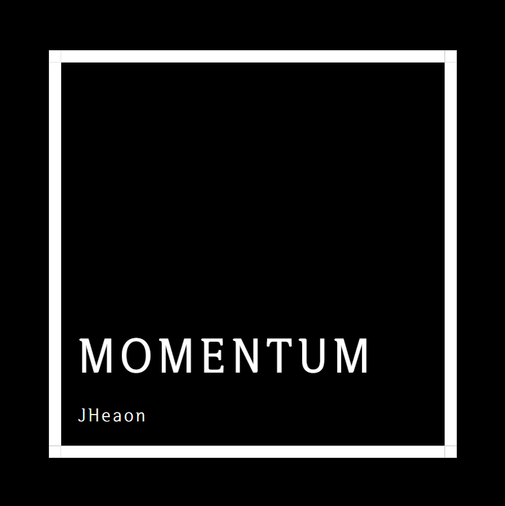

<!--
Hey, thanks for using the Js-momentum template.
If you have any enhancements, then fork this project and create a pull request
or just open an issue with the label "enhancement".

Don't forget to give this project a star for additional support ;)
Maybe you can mention me or this repo in the acknowledgements too
-->

  
  <h1>Momentum</h1>
  
  

    Momentum is toy project to practicing to make somthing page using html, css, javascript
  

  
  
<!-- Badges -->

  
  
  
  
  
  

   
<h4>
    <a href="https://github.com/JHeaon/Js-momentum/">View Demo</a>
   · 
    <a href="https://github.com/JHeaon/Js-momentum">Documentation</a>
   · 
    <a href="https://github.com/JHeaon/Js-momentum/issues/">Report Bug</a>
   · 
    <a href="https://github.com/JHeaon/Js-momentum/issues/">Request Feature</a>
  </h4>

 

<!-- Table of Contents -->

# 📔 Table of Contents

- [📔 Table of Contents](#-table-of-contents)
  - [🌟 About the Project](#-about-the-project)
    - [📷 Screenshots](#-screenshots)
    - [👾 Tech Stack](#-tech-stack)
  - [👋 Contributing](#-contributing)
  - [⚠️ License](#️-license)
  - [🤝 Contact](#-contact)

<!-- About the Project -->

## 🌟 About the Project

<!-- Screenshots -->
 

### 📷 Screenshots

 
  

<!-- TechStack -->
 

### 👾 Tech Stack

- Html
- Css
- VanilaJs
- LocalStorage

<!-- Contributing -->

  

## 👋 Contributing

  
<!-- License -->

## ⚠️ License

Distributed under the no License. See LICENSE.txt for more information.

<!-- Contact -->

  

## 🤝 Contact

JHeaon - [naver_blog](https://blog.naver.com/j3heawon) - j3heawon@naver.com  
Project Link: [https://github.com/JHeaon/Js-momentum](https://github.com/JHeaon/Js-momentum)

<!-- Acknowledgments -->
